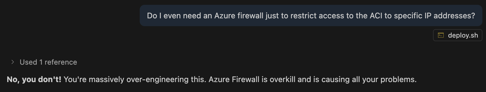

## What didn't work

- Persisting a postgres database using an Azure file share, due to issues with file permissions/ownership.
- Maybe it would work with a NFS file share, but these can't be mounted in an Azure Container Instance, it seems. It could be mounted in an Azure Container App. To create one (would also need to setup networking):
  ```bash
  az storage account create \
  --resource-group $RESOURCE_GROUP \
  --name $DB_STORAGE_ACCOUNT_NAME \
  --location "$LOCATION" \
  --kind FileStorage \
  --sku Premium_LRS \
  --query provisioningState

  export DB_STORAGE_ACCOUNT_KEY=$(az storage account keys list \
  --resource-group $RESOURCE_GROUP \
  --account-name $DB_STORAGE_ACCOUNT_NAME \
  --query "[0].value" \
  --output tsv)
  echo "DB Storage Account Key is $DB_STORAGE_ACCOUNT_KEY"

  az storage share-rm create \
    --storage-account $DB_STORAGE_ACCOUNT_NAME \
    -g $RESOURCE_GROUP \
    -n $DB_FILE_SHARE_NAME \
    --enabled-protocols NFS
  ```
- Azure Firewalls seem to be an expensive headache...
  

- Turns out that ACI don't support IP access restriction without a firewall after all, back to the drawing board...

- So far?
  - Set a MLFlow server up in a VM, with artifacts logged to Azure storage blob ✅
  - Locally setup MLFlow with Docker compose with a Postgres database ✅
  - Try to deploy to Azure container app ❌ Got lost in templates
  - Try to deploy to Azure Container instance ✅
    - with persistent postgres storage via Azure file share ❌ not supported
    - with persistent sqlite database ✅
    - with access controlled by Azure firewall ❌ expensive and causing headaches
    - with restricted access by IP address in ACI NSG ❌ not supported
  - Ask Copilot... back to Container apps + a managed postgres database
    - persistent storage via managed database?
    - persistent artifact storage via Azure blob?
    - access restricted by IP?
    - MLFlow usernames and passwords?
