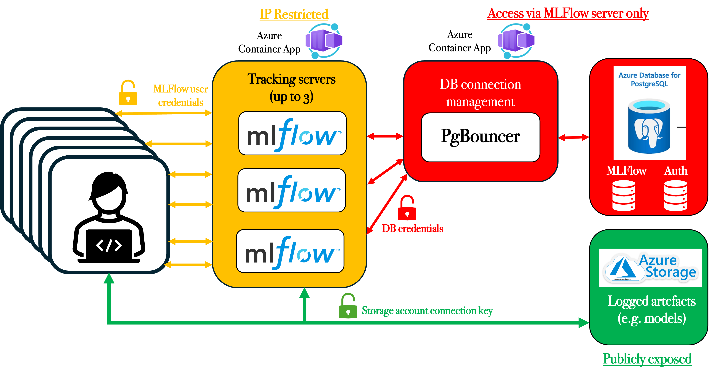

# ARC-MLFlow

Azure MLFlow deployment and instructions for how to use it. It deploys (with current parameters):

- MLFlow tracking servers to an Azure Container Apps environment, auto-scaling between 0 and 3 instances.
- An Azure PostgreSQL B1ms managed database for MLFlow logged metadata and metrics, and user details.
- A PgBouncer container to manage connection pools from the MLFlow tracking servers and the database.
- All of the above in a VNet, with access restricted to an IP allow list.
- An Azure Storage Account and Blob for storing artifacts (models etc.) Publicly exposed but with authenticated access.
- Basic user/password authentication to the MLFlow server (if we use/persist these servers we should setup SSO instead/as well as this)

## Pre-requisites

Install the Azure CLI and login, selecting the correct subscription (probably "ARC") as active, and install Python dependencies:

```bash
brew install azure-cli pwgen
az login
uv sync
```

`pwgen` is used to auto-generate passwords.

## MLFlow Account and Workspace Setup [for an existing server]

To run these commands you will need to know:

**If using the user interface:**
- The URL of the MLFlow server

**If using the setup scripts:**
  - The Azure resource group the MLFlow server has been deployed into (default: `arc-turing-mlflow`)
  - The name of the MLFlow container app (default: same as the resource group)
  - The Azure CLI installed and logged in (see pre-requisites)
  - A `uv` environment with `mlflow[auth]` installed in it.

Ask the owner of the server for these, or you can get them from the Azure portal yourself.

### User Setup

#### Create users in a browser

If you are logged in to the MLFlow UI as an admin, you can create users from there by clicking on your username (bottom left) then going to the "Manage" menu.

#### User creation script

Running the following script:

```bash
cd setup-env
bash make_env.sh
```

Will:

- Prompt for a username and password to create on the MLFlow server
- Ask for the resource group and app name of the deployed MLFlow server
- Create the user on the server
- Save a `.env` file containing the necessary environment variables to set to use it (`MLFLOW_TRACKING_URI`, `AZURE_STORAGE_CONNECTION_STRING`, `MLFLOW_TRACKING_USERNAME`, `MLFLOW_TRACKING_PASSWORD`)

Source the saved `.env` file (`source .env`) before running scripts using `mlflow`, or add them to your `.bash_profile`/`.zprofile`/similar.

### Add an Allowed IP Address

The Turing IP address is automatically added to the allow-list as part of the deployment (which will also be your IP address if you're on the VPN). If you need to add another, run:

```bash
cd setup-env
bash add_ip.sh
```

This will prompt for an IP address/address range to add, and a suitable label for it.

### Workspace Setup

Experiments and runs on the MLFlow server are grouped under a "workspace". For our purposes we will generally want a separate workspace for each project. To create one:

#### In the browser

If logged in to the MLFlow UI as an admin, the homepage showing the list of workspaces has a "Create new Workspace" button.

#### Workspace creation script

Running the `setup-env/create_workspace.sh` script will prompt for a workspace name and a username to make admin on that workspace, and create the workspace for you using the API.

#### Workspace permissions

User permissions should generally be managed via "roles", which can have multiple users assigned to them. The server is setup so that all users can *read* all workspaces, i.e. all users can see the content of all workspaces, but not create/change anything in them.

When a workspace is created, MLFlow creates two default roles for it - an admin role (which lets users change everything about the workspace including access permissions for it), and a user rule (which lets users create experiments in the workspace but doesn't allow them to use/edit other people's experiments).

You may want to create a role with "Edit" access to the workspace for project members, which allows users assigned to it to also use/edit other people's experiments.

## Using MLFlow in Python [with an existing server]

⚠️ The MLFlow server will automatically scale off if unused for a period of time (currently 15 minutes). The containers will ramp back up automatically when requested, but the first connectiion after the cooldown period will be slow.

General MLFlow documentation is available here: https://mlflow.org/docs/latest/ml/

### Python Dependencies

```bash
uv sync
```

The main ones are:

- `mlflow[auth]`: The Python library for interacting with a MLFlow server
- `psutil`, `nvidia-ml-py`: If you want to log system (CPU, GPU respectively) stats with your job
- `azure-storage-blob`, `azure-identity`: If you want to log artifacts (files, e.g. models), as these are stored in an Azure blob.

The rest of the dependencies in `pyproject.toml` are just for the examples.

### MLFlow Environment Variables

⚠️ These can be automatically obtained/set via the environment setup script described above.

You must have the following environment variables exported in your environment:

- `MLFLOW_TRACKING_URI` - the URL of the MLFlow server
- `MLFLOW_TRACKING_USERNAME` - your MLFlow username
- `MLFLOW_TRACKING_PASSWORD` - your MLFlow password
- `AZURE_STORAGE_CONNECTION_STRING` - the connection string for the Azure storage account for artefacts (only needed if you're logging artefacts to Azure). If you want to log an artifact locally instead, you should be able to do so by setting the `artifact_location` when creating the MLFlow experiment you are logging results to, e.g. `mlflow.create_experiment("experiment_name", artifact_location="/your/local/path")`.

### Examples

Example scripts you can run:

- `uv run mlflow-examples/hello.py`: Basic logging of a parameter, metric, and artifact.
- `uv run mlflow-examples/train.py`: Automated logging of metrics and models with the HuggingFace transformers Trainer
- `uv run mlflow-examples/sweep.py`: A hyperparameter sweep.

### The MLFlow UI

If you go to the `MLFLOW_TRACKING_URI` in a browser and enter your username and password you should get to the UI and be able to browse through your tracked experiments and artefacts.

## Creating a new Deployment

### Components



| Service | Quantity |
| --- | --- |
| Azure PostgreSQL B1ms with 32GB storage | 1 |
| MLFlow Container Apps (2.0 CPU, 4 GiB RAM) | 0-3 (autoscale) |
| PgBouncer Container App (0.25 CPU, 0.5 GiB RAM) | 0-1 (autoscale) |
| Azure Blob Storage | 1 |
| Private DNS Zone | 1 |
| Private Endpoint | 1 |

**Estimated Cost:**
- Light usage: £20/month (container apps mostly scaled to 0, ongoing database and networking costs only)
- Heavy usage: £500/month (dominated by MLFlow container costs, if they are scaled to 3 replicas 24/7)

### Container Builds

The `mlflow-container` and `pgbouncer-container` directories contain docker files for MLFlow and PgBouncer (for managing connections to the database). The images are hosted with the GitHub container registry, and will be rebuilt whenever a change is pushed to the relevant directory in the repo.

### Azure Deployment

First, edit any variables you would like to in `container-app/.env` - this specifies names, passwords, and IP restrictions for the deployment, for example. Ensure the resource group you're specifying doesn't already exist. By default passwords are auto-generated and access to the MLFlow server is restricted to the deployment IP address.

```bash
cd container-app
bash deploy.sh
```

### Updating the Server

🚨 **This has a high chance of breaking things!** 🚨 If MLFlow has released new features or made breaking changes since the last time the server was deployed, re-building the containers, deleting the old MLFlow deployment, and creating a new one is less likely to cause issues (but also not guaranteed).

1. Trigger re-builds via GitHub Actions if necessary
  - [MLFlow image action](https://github.com/alan-turing-institute/ARC-MLFlow/actions/workflows/build_mlflow.yaml)
  - [PG Bouncer image action](https://github.com/alan-turing-institute/ARC-MLFlow/actions/workflows/build_pgbouncer.yaml)

2. Trigger the container app to update:
  ```
  az containerapp update \
  --resource-group arc-turing-mlflow \
  --name arc-turing-mlflow \
  --image ghcr.io/alan-turing-institute/arc-mlflow-image:latest
  ```
  Replace `--name` with either the MLFlow or PG Bouncer container as required, e.g. `arc-turing-mlflow` or `pgboucner-app` (see `container-app/.env` for defaults).

### Delete the Deployment (and all data!)

```bash
az group delete --name $RESOURCE_GROUP
```

Where `$RESOURCE_GROUP` is the name of the resource group you deployed MLFlow to.
